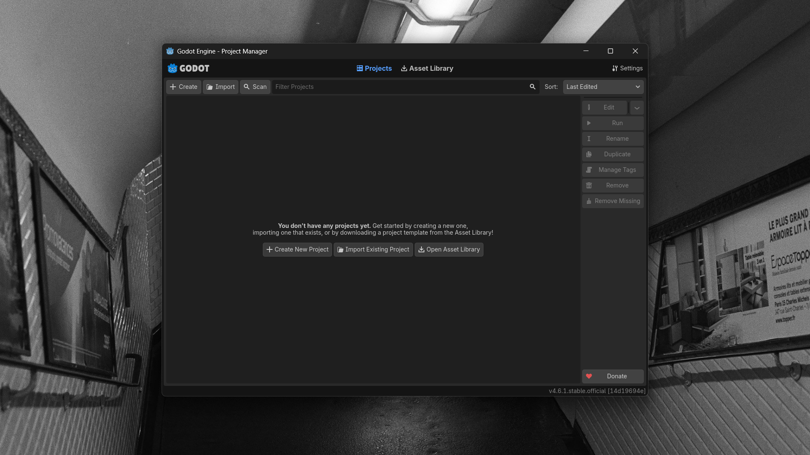

# Projet 1 - Devine le nombre

Dans cet atelier, on va **installer [Godot](#ressources-suplementaires/godot.md)**, appréhender son **interface**, puis créer notre **premier projet**. 

 

Pour apprendre les bases de [Godot](#ressources-suplementaires/godot.md) et de la programmation on va commencer par faire un jeu **type devine le nombre**.

> Le jeu génère un nombre aléatoire. Le joueur doit deviner ce nombre avec comme indices: "plus grand" ou "plus petit".

## I. Télécharger Godot

Rendez vous sur ce lien: <a href="https://godotengine.org/download/windows/" class="external-link">godotengine.org/download/windows</a>, puis téléchargez la version ***Godot Engine*** et non *Godot Engine - .NET*.

> Il est techniquement tout à fait possible d'utiliser la version .NET pour tout le reste. Cette version est **la même** mais avec le support du language **C# en plus**, mais nous n'en avons **pas besoin**.

Une fois téléchargé, vous vous retrouvez avec un fichier **.zip** qui contient deux fichier: **Godot_v4.6.1-stable_win64.exe** et **Godot_v4.6.1-stable_win64_console.exe**.

> Le **premier** est le **moteur de jeu**. (oui, oui, le **moteur de jeu Godot entier** ne fait que **165 Mo**, contre plus de 10 Go pour Unity) 
> Le second *(celui en '_console')* va lancer le moteur de jeu avec une deuxième fenêtre: **une console**. On en aura pas besoin.

Vous pouvez ranger ces fichiers où vous voulez. On va maintenant lancer le premier fichier: **Godot_v4.6.1-stable_win64.exe** (Il est possible que le nom soit différent si vous êtes sur linux ou mac, ou encore is la version de Godot est différente)

## II. Créer un projet

Une fois [Godot](#ressources-suplementaires/godot.md) ouvert, on tombe sur le [Project Manager](#ressources-suplementaires/godot.md#project-manager):

On va alors créer un nouveau projet en cliquant sur **+ Create**.

Puis rensigner le **nom du projet** et son **chemin** (là où il est enregistré).

Et enfin le [renderer](#ressources-suplementaires/godot.md#renderer) que l'on va mettre sur **Compatibility**. 

Enfin, on clique sur **Create** et ça nous ouvre la fenêtre de l'**éditeur** de [Godot](#ressources-suplementaires/godot.md).

## L'interface de Godot

L'interface de l'**éditeur** de [Godot](#ressources-suplementaires/godot.md) se compose de plusieurs fenêtres et menus.

### Le menu des onglets

Ce menu permet de changer la **fenêtre** affichée au **centre** entre cinq onglets: [2D](#ressources-suplementaires/godot.md#onglet-2d), [3D](#ressources-suplementaires/godot.md#onglet-3d), [Script](#ressources-suplementaires/godot.md#onglet-script), [Game](#ressources-suplementaires/godot.md#onglet-game) et [AssetLib](#ressources-suplementaires/godot.md#onglet-assetlib).

### La fenêtre principale

La fenêtre centrale qui va afficher un des cinq onglets ([2D](#ressources-suplementaires/godot.md#onglet-2d), [3D](#ressources-suplementaires/godot.md#onglet-3d), [Script](#ressources-suplementaires/godot.md#onglet-script), [Game](#ressources-suplementaires/godot.md#onglet-game) et [AssetLib](#ressources-suplementaires/godot.md#onglet-assetlib)). Dans cet atelier, on va utiliser les onglets [2D](#ressources-suplementaires/godot.md#onglet-2d), pour poser **nos éléments de jeux 2D** (boutons, images, textes etc...) et [Script](#ressources-suplementaires/godot.md#onglet-script), pour **programmer la logique** de notre jeu.

### La fenêtre Scene

La fenêtre scene représente notre [Scene Tree](#ressources-suplementaires/godot.md#scene-tree) *(l'arborescance de notre scène)*. Et juste à coté, la fenêtre d'[import](#ressources-suplementaires/godot.md#import).

###  Le FileSystem

La fenêtre du [file system](#ressources-suplementaires/godot.md#file-system) permet de voir et d'accéder à tous nos fichiers.

### L'Inspecteur

L'[inspecteur](#ressources-suplementaires/godot.md#inspecteur) permet de modifier les propriétés de nos objets. 
Sur cette fenêtre on a égallement accès à l'[historique](#ressources-suplementaires/godot.md#historique), les [signaux](#ressources-suplementaires/godot.md#signaux), et les [groupes](#ressources-suplementaires/godot.md#groupes)

## III. Créer la scène de jeu

Au niveau de la fenêtre de la [scène](#ressources-suplementaires/godot.md#scene-tree), on va appuyer sur **User Interface**.