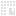
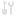
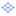
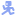
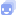
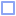
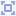
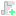
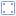
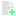

# <div class="icon" style="mask-image: url(./medias/icons/plateformer-icon.svg)"></div> Jeu de plateforme

Dans cet atelier, on va créer un jeu de plateforme 2D [side-scroller](#ressources-suplementaires/lexique-game-dev.md#side-scroller) en [ TileSet](#ressources-suplementaires/lexique-game-dev.md#tileset).

## Jeu

<iframe-player launchFullscreen="true" title="Jeu de Plateforme" class="game" src="./game-builds/jeu-de-plateforme/index.html"></iframe-player>

## Préparation de la scène

Comme la dernière fois, on vas **créer un nouveau projet**. On lui donne un **nom** et un **emplacement** puis on choisi **compatibility** pour le [renderer](#godot/godot.md#renderer).


Cette fois-ci on va créer une **scène 2D**.


Je vais l'appeller *Game*. <span style="color: var(--body-text-color-faded); font-size: .8em">(N'oubliez pas d'**enregistrer la scène** et d'**enregistrer souvent** votre travail !)</span>

<div class="side-by-side">


</div>

### Télécharger les assets

Pour ce jeu, on va utiliser un [ tileset](#ressources-suplementaires/lexique-game-dev.md#tileset). On pourrait le **dessiner à la main** avec par exemple [Pixelorama](#ressources-suplementaires/pixelorama.md) mais c'est **plus simple** pour aujourd'hui d'en **télécharger** un déjà fait.

Vous pouvez utiliser le même que moi en le **téléchargant** à ce <a class="external-link" href="https://downgit.github.io/#/home?url=https://github.com/RSelaries/ateliers-gamejam/blob/main/projets/jeu_de_plateforme/assets">lien</a>. Ou bien en **télécharger un autre**, par exemple en cherchant <a class="external-link" href="https://itch.io/game-assets/tag-side-scroller/tag-tileset">ici</a>.

<br>

Une fois ça fait vous pouvez ajouter le dossier *assets* à votre projet *(ou bien le créer)*.


Ici, on vient d'ajouter une **image** <span style="color: var(--body-text-color-faded); font-size: .8em">(une texture)</span> d'un **tileset** <span style="color: var(--body-text-color-faded); font-size: .8em">(une texture atlas)</span>. Mais pour qu'il soit **utilisable** par Godot il faut créer une **ressource** [ TileSet](#ressources-suplementaires/lexique-game-dev.md#tileset).

### Création du TileSet

<div class="side-by-side content">


</div>

On peut alors l'**enregistrer**, je l'ai appelé simplement *"tileset"*. Cela nous **ouvre** alors l'**onglet** de [ TileSet](#godot/interface.md#tileset) en bas de l'écran où l'on peut **paramétrer** notre  TileSet.


Il faut maintenant ajouter la texture atlas <span style="color: var(--body-text-color-faded); font-size: .8em">(notre image *tileset_atlas.png*)</span>.


Godot vas alors nous proposer de **créer automatiquement** les **Tiles** pour nous. **On vas répondre non** étant donné que ce tileset fait **12x12** au lieu des **16x16** traditionnels. <span style="color: var(--body-text-color-faded); font-size: .8em">(Si vous avez téléchargé un tileset 16x16 ou 32x32 vous pouvez répondre oui, il y a plus de chance que cela fonctionne pour vous)</span>


On se retrouve alors devant cet écran, on doit maintenant paramétrer notre tileset.


Le plus **important** est le **paramètre** `texture_region`. Il est par défaut en **16x16**, je vais donc le mettre à **12x12**.


<div class="side-by-side">


</div>

Une fois ça fait, il faut définir les tuiles (Tiles) qui peuvent être utilisées.

Pour cela, il suffit de cliquer sur les tuiles que l'on va utiliser en étant en mode  Setup


## Création de la TileMap

Pour cela, il faut ajouter un [ TileMapLayer](#godot/nodes.md#tilemaplayer) à notre scène.

<div class="side-by-side two-to-one">


</div>

Ensuite on ajoute le **TileSet** que l'on a créé dans le **paramètre** `tileset` de le [ TileMapLayer](#godot/nodes.md#tilemaplayer).

On clique dessus puis sur *"Quick load"* et on sélectionne le **TileSet** que l'on a créé.


Cela nous ouvre alors l'onglet [ TileMap](#godot/interface.md#tilemap) avec notre TileSet de sélectionné.


## Création d'un niveau

Maintenant il nous suffit de **cliquer sur une tuile** dans cette fenêtre et on peut commencer à **peindre notre niveau**:


Mais on a un petit **soucis**: les **pixels** des tuiles sont **flous**.

<div class="side-by-side">


</div>

Par défaut Godot **lisse les textures**, c'est l'*anti-aliasing*.

Pour palier à cela, il faut modifier les **paramètres du projet**. Plus précisément: mettre le **paramètre** `default_texture_filter` sur `Nearest`.


Maintenant on peut **créer notre premier niveau**. <span style="color: var(--body-text-color-faded); font-size: .8em">Pour plus de précision sur la peinture des Tiles rendez vous sur la page [ TileMap](#godot/interface.md#tilemap).</span>

### Niveau de test

Je vais faire mon niveau sur plusieurs *"calques"*, pour cela il me suffit d'utiliser un [ TileMapLayer](#godot/nodes.md#tilemaplayer) par *"calque"*. Je vais les renommer pour plus de clarté.

<div class="side-by-side">


</div>

<div class="side-by-side">


</div>

Je vais aussi **modifier** la **couleur de fond** pour la mettre en noir.


> **Prenez le temps de faire un niveau que vous aimez !**

## Création du personnage

Maintenant il nous faut un **personnage** pour se balader dans notre niveau.

Pour commencer on vas créer une scène avec un node [ CharacterBody2D](#godot/nodes.md#characterbody2d) comme racine.

<div class="side-by-side two-to-one" style='grid-template: "a c" "b c" / 1fr 2fr;'>


</div>

<div class="side-by-side">


</div>

<span style="color: var(--body-text-color-faded); font-size: .8em">N'oubliez pas de sauvegarder !</span>

### Ajouter un sprite

Maintenant on aimerai que notre personnage ai une **image**. Pour ça il lui faut un [Sprite](#ressources-suplementaires/lexique-game-dev.md#sprite).

On va donc ajouter un [ AnimatedSprite2D](#godot/nodes.md#animatedsprite2d).

> <span style="color: var(--body-text-color-faded); font-size: .8em">On **pourrait** utiliser un simple [ Sprite2D](#godot/nodes.md#sprite2d) mais un [ AnimatedSprite2D](#godot/nodes.md#animatedsprite2d) nous permet de l'**animer** plus simplement.</span>

<div class="side-by-side">


</div>

À cet [ AnimatedSprite2D](#godot/nodes.md#animatedsprite2d), on ajoute une **ressource**  SpriteFrames que l'on va **paramétrer**.

Pour cela il suffit de cliquer dessus, ce qui nous ouvre l'onglet des  SpriteFrames.


<span style="color: var(--body-text-color-faded); font-size: .8em">Attention à bien paramétrer la taille sur 12x12 pour notre [ TileSet](#godot/interface.md#tileset) !</span>

### Ajouter une collision

On voit qu'à coté de notre [ Player](#godot/nodes.md#characterbody2d) il y a un "" qui signifie qu'il y a un ou des **avertissement(s)** qui sont les suivants:


Ce message nous indique que notre [ CharacterBody2D](#godot/nodes.md#characterbody2d) n'as pas de collision et nous conseille d'en ajouter une.

Effectivement, le [ CharacterBody2D](#godot/nodes.md#characterbody2d) est un Node qui **réagit à la physique** *(la gravité, les murs etc...)*. Il lui faut donc une zone de **collision**. On lui **ajoute** alors tout simplement un node [ CollisionShape2D](#godot/nodes.md#collisionshape2d).


De même, notre [ CollisionShape2D](#godot/nodes.md#collisionshape2d) a aussi un  **warning**:
> "A shape must be provided for CollisionShape2D to function. Please create a shape resource for it!"

Ce qui signifie que notre **collision** nécessite une **forme** pour fonctionner. On va donc lui en ajouter une dans sa **propriété** `shape`.

On veut que le **dessous** de cette forme soit **aligné** au pieds de notre [ Player](#godot/nodes.md#characterbody2d) il y a un ".


### Programmation

On va maintenant passer à la **programmation** de notre **personnage** !

<br>

D'abord on ajoute un [ Script](#godot/interface.md#onglet-script) à notre joueur.

<div class="side-by-side content">


</div>

<span style="color: var(--body-text-color-faded); font-size: .8em">On va utiliser le template *Basic Movement* parce qu'il contient déjà la majorité du code que l'on veut utiliser.</span>


**Analysons** ce code ensemble **ligne par ligne**.

#### Les constantes

D'abord on définie deux **constantes** <span style="color: var(--body-text-color-faded); font-size: .8em">(des variables dont la valeur ne change pas)</span>

```gdscript
const SPEED = 300.0
const JUMP_VELOCITY = -400.0
```

- `SPEED` représente la **vitesse** en **pixels par seconde**.

- `JUMP_VELOCITY` représente l'**accélération** en **pixels par seconde** du **saut**.

<span style="color: var(--body-text-color-faded); font-size: .8em">(Le nombre est négatifs car en 2D, les coordonnées commencent dans le coin supérieur gauche. Quand on descend sur l'écran, la valeur `y` augmente. Donc pour monter il faut utiliser un nombre négatif.)</span>

#### _physics_process

```gdscript
func _physics_process(delta: float) -> void:
```

Le code **tourne** dans la fonction `_phyisics_process` et non `_process`, pourquoi ?

- La fonction `_process` est **appelée** à chaque [frame](#ressources-suplementaires/lexique-game-dev.md#frame), que le jeu tourne à **30fps** ou **600fps**.

- La fonction `_phyisics_process` elle, est **appelée** sur un **cycle régulier** <span style="color: var(--body-text-color-faded); font-size: .8em">(par défaut 60 fois par secondes)</span>. L'idée est que la plupart des **calculs de physique** sont plus **lourds**. Donc pour éviter de **ralentir** le jeu, la physique ne tourne que **60 fois par seconde** même si le reste du jeu tourne à **300fps**.

> *En bref, la fonction `physics_process` sert à calculer la physique des nodes.*

#### La gravité

D'abord, si le **joueur** n'est **pas** sur le **sol**, on vas lui **appliquer la gravité**.

```gdscript
if not is_on_floor():
	velocity += get_gravity() * delta
```

> Le node [ CharacterBody2D](#godot/nodes.md#characterbody2d) est utilisé avec sa **propriété** `velocity` qui servira à calculer son **mouvement**. Pour **appliquer** sa **vélocité** il suffit d'utiliser la **fonction** `move_and_slide()`.

> <span style="color: var(--body-text-color-faded); font-size: .8em">Il contient plusieurs fonction utiles comme `is_on_floor()`.</span>

#### Sauter

Ensuite, on **test** si le joueur **appuye** sur la **touche de saut**. Si c'est le cas, on **applique** la valeur de notre **constante** `JUMP_VELOCITY` à la **vélocité** de notre personnage.

```gdscript
if Input.is_action_just_pressed("ui_accept") and is_on_floor():
	velocity.y = JUMP_VELOCITY
```

> La **fonction** `Input.is_action_just_pressed(input_name)` permet de **tester** si le joueur **appuie** sur un **bouton**.

#### Déplacements

Après cela, on **calcule** la **direction** que doit prendre le **personnage** selon les **boutons** que le **joueur presse**.

```gdscript
var direction := Input.get_axis("ui_left", "ui_right")
```

> La fonction `Input.get_axis(negative_action, positive_action)` **retourne** un **nombre** entre **-1** <span style="color: var(--body-text-color-faded); font-size: .8em">(si la direction est à gauche)</span> et **1** <span style="color: var(--body-text-color-faded); font-size: .8em">(à droite)</span>. Elle prend en **entrée** les **noms** des bouton **gauche** et **droite**.

```gdscript
if direction:
    velocity.x = direction * SPEED
else:
    velocity.x = move_toward(velocity.x, 0, SPEED)
```

- `if direction`: **si** la **direction** n'est pas égale à 0 <span style="color: var(--body-text-color-faded); font-size: .8em">(et donc que le joueur appuie sur droite ou gauche)</span>.

    - `velocity.x = direction * SPEED`: alors on modifie la **vélocité** sur l'axe `x` <span style="color: var(--body-text-color-faded); font-size: .8em">(l'axe horizontal)</span> vers la `direction` et à la vitesse `SPEED`.

- `else:`: **sinon**

    - `velocity.x = move_toward(velocity.x, 0, SPEED)`: on **décélère** jusqu'à être immobile et on le fait à une vitesse `SPEED`.

Enfin, on dit à Godot de calculer la physique de notre personnage en appelant la fonction `move_and_slide()`.

## Test du jeu

**On peut maintenant tester notre jeu !**

<br>

Pour cela, on retourne sur la scène *Game* et on y glisse la scène du **joueur**.


Et maintenant on peut **tester** le jeu en appyant sur **F6** <span style="color: var(--body-text-color-faded); font-size: .8em">(ou sur )</span>.

<br>

**Mais gros problème !** La scène du jeu n'est pas du tout **centrée** !


### La caméra

Pour résoudre cela, on pourrait **décaler toute la scène**, mais le plus simple reste d'**ajouter une camera**. On ajoute alors une [ Camera2D](#godot/nodes.md#camera2d).


**Testons de nouveau !**


### Les collisions

Maintenant on se rend compte d'un **problème de collision**: **le personnage traverse le sol**.

Pour résoudre ce problème il faut modifier notre ressource [ tileset](#ressources-suplementaires/lexique-game-dev.md#tileset) pour que le sol et les murs aient des collisions.

<br>

Pour cela, on ajoute un `physics_layer` à notre [ tileset](#ressources-suplementaires/lexique-game-dev.md#tileset).

<div class="side-by-side two-to-one" style="grid-template-columns: 1fr 1fr">


</div>

Puis on applique la **collision** sur les murs.


**Testons encore !** C'est en testant qu'on trouve les **problèmes**.


### Les mouvements

**Ça fonctionne !** Mais le joueur se déplace **trop rapidment**. Il nous suffit de modifier ses **constantes** pour changer sa **vitesse**.

Je vais modifier

```gdscript
const SPEED = 300.0
const JUMP_VELOCITY = -400.0
```

en

```gdscript
const SPEED = 100.0
const JUMP_VELOCITY = -300.0
```

pour une meilleure prise en main.

## Amméliorations

On a maintenant un jeu **plus ou moins jouable**. Il est temps de l'**amméliorer** pour qu'il soit plus **intéressant** !

### Collisions v2

Pour commencer, on vas continuer la mise en place des **collisions** de notre [ tileset](#ressources-suplementaires/lexique-game-dev.md#tileset).

On va alors leur ajouter des **collisions**, changer leur **forme** et créer une **plateforme directionnelle** !

<br>

Pour cela, on change la forme de la **collision**, puis on active le **paramètre** `polygon_0_one_way`. L'idée est que *one way* signifie que la **collision** n'est active que d'**un coté**. On peut donc **monter** sur la plateforme **par en bas**.


On ajoute une plateforme pour tester le jeu.


### Bouton intéractible

Le [ tileset](#ressources-suplementaires/lexique-game-dev.md#tileset) que nous avont téléchargé contient des petits **écrans**, on va les utiliser pour créer de l'**intéraction** avec le **niveau**.

<br>

On vas alors créer une nouvelle **scène** avec un [ Area2D](#ressources-suplementaires/lexique-game-dev.md#area2d) en racine.

> Une [ Area2D](#ressources-suplementaires/lexique-game-dev.md#area2d) nous permet de détecter quand un node **physique** entre dans son **périmètre**.

On lui rajoute un [ AnimatedSprite2D](#godot/nodes.md#animatedsprite2d) puis une [ CollisionShape2D](#godot/nodes.md#collisionshape2d).


<span style="color: var(--body-text-color-faded); font-size: .8em">(Si vous ne vous rappelez pas de comment créer une scène, une collision ou un sprite, référez vous à [# Création du personnage](#ateliers/jeu-de-plateforme.md#creation-du-personnage))</span>

#### Programmation bouton

On ajoute un script () à notre [ OrdinateurBouton](#ressources-suplementaires/lexique-game-dev.md#area2d). Ensuite on connecte son **signal** `body_entered`.


Maintenant on veut que quand le  **personnage** joueur se trouve près de l'**ordinateur**, on lui propose d'**intéragir** avec.

Pour détecter si le `body` qui est entré dans le périmètre de notre [ Area2D](#ressources-suplementaires/lexique-game-dev.md#area2d) est bien le **joueur**, on va l'ajouter dans un [ groupe](#godot/godot.md#groupes).


Il nous est maintenant possible d'accèder à notre joueur simplement à l'aide de son groupe.

```gdscript
extends Area2D


func _on_body_entered(body: Node2D) -> void:
    if body.is_in_group("player"):
        print("Le joueur s'est approché de l'ordinateur")
```

Pour **tester** si notre code **fonctionne**, il nous suffit de **remplacer** l'écran que l'on avait précédamment placé sur notre [ TileMapLayer](#godot/nodes.md#tilemaplayer) par la scène **OrdinateurBouton** que nous venons de créer.


#### Intéraction

Pour **prévenir** le joueur qu'il peut **intéragir** avec l'**ordinateur**, on va ajouter le **texte**: "↑ intéragir" à l'aide d'un [ Label](#godot/nodes.md#label). On va égallement changer la **fonte** (en *Tiny5*) du label pour quelque chose de plus **pixélisé**.


Puis on modifie le code:

```gdscript
extends Area2D


@onready var label_interaction: Label = $LabelInteraction


var player_inside := false


func _ready() -> void:
    label_interaction.hide()


func _on_body_entered(body: Node2D) -> void:
    if body.is_in_group("player"):
        label_interaction.show()

```

Dans `_ready` on utilise la fonction `hide` pour que le **texte** ne sois **pas visible**. Si le **joueur s'approche**, on l'**affiche**.

On va égallement connecter le signal `body_exited` de notre [ Area2D](#ressources-suplementaires/lexique-game-dev.md#area2d). Quand le joueur s'éloigne de l'ordinateur, on n'affiche plus le texte.


Puis modifier la **fonction** appelée par le **signal**:

```gdscript
func _on_body_entered(body: Node2D) -> void:
    if body.is_in_group("player"):
        label_interaction.show()
        player_inside = true


func _on_body_exited(body: Node2D) -> void:
    if body.is_in_group("player"):
        label_interaction.hide()
        player_inside = false
```

Enfin, on teste si le joueur **appuie** sur la **touche** pour **intéragir** <span style="color: var(--body-text-color-faded); font-size: .8em">(flèche du haut)</span>, et si c'est le cas, on va ouvrir les murs intéractifs <span style="color: var(--body-text-color-faded); font-size: .8em">(que l'on va créer juste après)</span>.

```gdscript
func _unhandled_input(event: InputEvent) -> void:
    if event.is_action_pressed("ui_up") and player_inside:
        get_tree().call_group("interaction_wall", "toggle_open")
```

> La **fonction** `_unhandled_input(event: InputEvent)` est appelée dès qu'une **touche est pressée**, que la **souris bouge**, qu'un **bouton** d'une **manette** est appuyé etc. La fonction contient une **variable** `event` qui représente le **type d'input** qui a été détecté.

La fonction `event.is_action_pressed(action_name)` permet de détecter si l'action `action_name` est appuyé. Si on détecte que le joueur appuie sur la touche flèche du haut <span style="color: var(--body-text-color-faded); font-size: .8em">(`"ui_up"`)</span> et qu'il est proche de l'ordinateur <span style="color: var(--body-text-color-faded); font-size: .8em">(`player_inside = true`)</span> alors on appelle la fonction `toggle_open` sur tous les nodes qui appartiennent au groupe `interaction_wall`.

### Murs Interactibles

**Il est temps de créer ces murs intéractibles !** On commence par créer une nouvelle **scène** avec pour racine un [ StaticBody2D](#ressources-suplementaires/lexique-game-dev.md#staticbody2d).

> Un [ StaticBody2D](#ressources-suplementaires/lexique-game-dev.md#staticbody2d) est un node **physique** mais **immobile**. Cela permet surtout de créer des **murs** et des **collisions** pour certains éléments.

Il lui fait aussi un [ AnimatedSprite2D](#godot/nodes.md#animatedsprite2d) ainsi qu'une [ CollisionShape2D](#godot/nodes.md#collisionshape2d).

<div class="side-by-side">


</div>

Pour l'[ AnimatedSprite2D](#godot/nodes.md#animatedsprite2d) j'ai créé **une animation par état**: **ouvert** et **fermé**.


<span style="color: var(--body-text-color-faded); font-size: .8em">(Pour ajouter une nouvelle animation, il suffit d'appuyer sur )</span>

#### Programmation murs

On ajoute un script. On va créer la fonction `toggle_open`:

```gdscript
extends StaticBody2D


@onready var collision_shape_2d: CollisionShape2D = $CollisionShape2D
@onready var animated_sprite_2d: AnimatedSprite2D = $AnimatedSprite2D


var opened := false


func toggle_open() -> void:
    if opened:
        collision_shape_2d.disabled = false
        animated_sprite_2d.play("closed")
        opened = false
    else:
        collision_shape_2d.disabled = true
        animated_sprite_2d.play("opened")
        opened = true
```

Quand la fonction `toggle_mode()` est appelée, **si le mur est fermé**, alors **on l'ouvre**.

<br>

C'est à dire qu'on met l'**animation** du mur **ouvert** <span style="color: var(--body-text-color-faded); font-size: .8em">(`animated_sprite_2d.play("closed")`)</span>, qu'on **désactive les collisions** <span style="color: var(--body-text-color-faded); font-size: .8em">(`collision_shape_2d.disabled = true`)</span> et qu'on change la **variable** `opened` sur `true` <span style="color: var(--body-text-color-faded); font-size: .8em">(donc ouvert)</span>.

<br>

Enfin, on ajoute le mur intéractif au **groupe** `interaction_wall`.


### Modification du niveau

Comme pour l'ordinateur, on va les retirer du [ TileMapLayer](#godot/nodes.md#tilemaplayer). Mais on peut faire **mieux**: on va **ajouter** les scènes de l'ordinateur et des murs intéractifs à notre [ TileSet](#ressources-suplementaires/lexique-game-dev.md#tileset).


## C'est fini !

**Le jeu est maintenant dans un état jouable!** Il manque beaucoup d'éléments pour le rendre plus agréable, malheureusement cet atelier est déjà très long. Mais si vous voulez peaufiner le jeu vous pouvez consulter la page [aller plus loin](#ateliers/jeu-plateforme-plus-loin.md).

> Vous pouvez **retrouver l'intégraliter du projet** dans le <a class="external-link" href="https://github.com/RSelaries/ateliers-gamejam">repo</a> de ces ateliers au lien suivant: <a class="external-link" href="https://https://github.com/RSelaries/ateliers-gamejam/tree/main/projets/jeu_de_plateforme">https://github.com/RSelaries/ateliers-gamejam/tree/main/projets/jeu_de_plateforme</a>.

> Vous pouvez aussi directement **télécharger le projet** <a class="external-link" target="_blank" href="https://downgit.github.io/#/home?url=https://https://github.com/RSelaries/ateliers-gamejam/tree/main/projets/jeu_de_plateforme">ici</a>.
