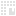
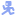
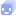

# <div class="icon" style="mask-image: url(./medias/icons/plateformer-icon.svg)"></div> Atelier 2 - Jeu de plateforme

Dans cet atelier, on va créer un jeu de plateforme 2D [side-scroller](#ressources-suplementaires/lexique-game-dev.md#side-scroller) en [ TileSet](#ressources-suplementaires/lexique-game-dev.md#tileset).

<details class="learning-details">
    <summary>Concepts Abordés</summary>
    <ul>
        <li><a href="#godot/nodes.md#tilemaplayer"> TileMapLayer</a></li>
        <li><a href="#godot/nodes.md#characterbody2d"> CharacterBody2D</a></li>
        <li>La physique de Godot</li>
    </ul>
</details>

## Jeu

<iframe-player launchFullscreen="true" title="Jeu de Plateforme" class="game" src="./game-builds/jeu-de-plateforme-v2/index.html"></iframe-player>

## Création du projet

Comme la dernière fois, on va créer un **nouveau projet**.

<viewable-image src="./medias/jeu-de-plateforme-v2/platformer-start-1.gif"></viewable-image>

<span style="color: var(--body-text-color-faded); font-size: .8em">Pensez à utiliser le renderer "<em>Compatibility</em>" !</span>

<br>

Une fois le projet créé, on va télécharger les assets de notre jeu. Vous pouvez directement télécharger le dossier */assets/* de mon projet <a class="external-link" href="https://downgit.github.io/#/home?url=https://github.com/RSelaries/ateliers-gamejam/tree/main/projets/jeu_de_plateforme_v2/assets" target="blank" download>ici</a>.

> <span style="color: var(--body-text-color-faded); font-size: .8em">Je vous conseille fortement d'utiliser le dossier /assets/ que je fourni, mais vous pouvez également chercher un tileset vous même. Vous pouvez par exemple chercher <a class="external-link" href="https://itch.io/game-assets/tag-side-scroller/tag-tileset" target="blank">ici</a>.</span>

Il nous suffit ensuite de **décompresser** le fichier *zip*, puis de le glisser dans notre projet.

<viewable-image src="./medias/jeu-de-plateforme-v2/platformer-start-2.gif"></viewable-image>

Le dossier */assets/* contient plusieurs sous-dossiers et fichiers. Pour l'instant le plus important pour nous est le fichier *tileset_texture.png*.

<viewable-image src="./medias/jeu-de-plateforme-v2/platformer-start-3.png"></viewable-image>

## Création du tileset

Pour ce second jeu, nous allons utiliser la technique de création d'environement appelé [Tileset](#ressources-suplementaires/lexique-game-dev.md#tileset). Pour pouvoir utiliser le tileset que l'on a téléchargé <span style="color: var(--body-text-color-faded); font-size: .8em">(*/tileset_texture.png*)</span> dans Godot, il faut créer une ressource  **Tileset**.

<br>

Pour créer une ressource, il suffit de faire *clic-droit* dans le [ FileSystem](), puis " New Resource..." et enfin chercher la ressource  **Tileset**.

<viewable-image src="./medias/jeu-de-plateforme-v2/platformer-start-4.gif"></viewable-image>

Une fois le  Tileset créé, un onglet " Tileset" s'ouvre automatiquement dans la fenêtre du bas. Si ce n'est pas le cas, il suffit de re-sélectionner le fichier *"tileset.tres"*.

Dans la fenêtre  Tileset, il faut ajouter notre *"tileset_texture.png"*, pour cela on clique sur  puis sur *"atlas"* et enfin on sélectionne notre fichier.

<viewable-image src="./medias/jeu-de-plateforme-v2/platformer-start-5.gif"></viewable-image>

Godot nous informe:

> The atlas's texture was modified.<br>Would you like to automatically create tiles in the atlas ?

Si on répond "Yes", Godot va tenter de **détecter automatiquements les tuiles**. On peut sélectionner "Yes".

## Création du premier niveau

On peut maintenant commencer à créer notre premier niveau !

<br>

On va créer une scène *"level_1"* de type [ Node2D](#godot/nodes.md#node2d) que l'on va ranger dans un dossier *"/levels/"*.

<viewable-image src="./medias/jeu-de-plateforme-v2/platformer-level1-1.gif"></viewable-image>

### Peinture des tuiles

On peut ajouter un node [ TileMapLayer](#godot/nodes.md#tilemaplayer) à notre scène.

<viewable-image src="./medias/jeu-de-plateforme-v2/platformer-level1-2.gif"></viewable-image>

On va ensuite utiliser notre " tileset.tres" pour la propriété `tile_set` du [ TileMapLayer](#godot/nodes.md#tilemaplayer).

<viewable-image src="./medias/jeu-de-plateforme-v2/platformer-level1-3.gif"></viewable-image>

Dans la fenêtre " TileMap", on peut utiliser l'outil "" pour peindre des tuiles.

<viewable-image src="./medias/jeu-de-plateforme-v2/platformer-level1-4.gif"></viewable-image>

Je vais créer un petit niveau de test.

<div class="side-by-side">
    <viewable-image src="./medias/jeu-de-plateforme-v2/platformer-level1-5.gif"></viewable-image>
    <viewable-image src="./medias/jeu-de-plateforme-v2/platformer-level1-6.png"></viewable-image>
</div>

**Super !** On a un magnifique niveau, mais deux problèmes:

- Le fond est gris et moche.

- Les textures sont étrangement floues.

### Changer la couleur du fond

Pour changer la couleur du fond, il faut changer les paramètres de projet: *"Project > Project Settings..."*. Puis dans les paramètres: *"Rendering > Environment > Default Clear Color"* qu'on modifie pour du noir.

<viewable-image src="./medias/jeu-de-plateforme-v2/platformer-level1-7.gif"></viewable-image>

### Textures "pixélisées"

Pour que nos textures soient bien pixélisées il faut également modifier un paramètre de projet: *"Rendering > Textures > Canvas Textures > Default Texture Filter"* > *Nearest*.

<viewable-image src="./medias/jeu-de-plateforme-v2/platformer-level1-8.gif"></viewable-image>

<div class="side-by-side">
    <viewable-image src="./medias/jeu-de-plateforme-v2/platformer-level1-9.png"></viewable-image>
    <viewable-image src="./medias/jeu-de-plateforme-v2/platformer-level1-10.png"></viewable-image>
</div>

<span style="color: var(--body-text-color-faded); font-size: .8em">Comparaison AVANT - APRÈS</span>

## Création du personnage

Maintenant que l'on a créé *le meilleur niveau de l'histoire du jeu vidéo*, il nous faut un **personnage** qui puisse se déplacer dans ce niveau.

<br>

Pour cela, on va créer une nouvelle scène *"player.tscn"* de type [ CharacterBody2D](#godot/nodes.md#characterbody2d) que l'on va ranger dans un dossier *"/player/"*.

<viewable-image src="./medias/jeu-de-plateforme-v2/platformer-player-1.gif"></viewable-image>

### Texture du personnage

On aimerait **ajouter une texture à notre personnage**. On peut utiliser un node [ AnimatedSprite2D](#godot/nodes.md#animatedsprite2d).

<viewable-image src="./medias/jeu-de-plateforme-v2/platformer-player-2.gif"></viewable-image>

Pour paramétrer le sprite, on va ajouter une ressource  SpriteFrame, dans laquelle on ajoute les animations de notre personnage.

<viewable-image src="./medias/jeu-de-plateforme-v2/platformer-player-3.gif"></viewable-image>

Je vais créer 4 animations:

- **Idle**: Quand le personnage est immobile.

<viewable-image src="./medias/jeu-de-plateforme-v2/platformer-player-4.png"></viewable-image>

- **Run**: Quand le personnage se déplace.

<viewable-image src="./medias/jeu-de-plateforme-v2/platformer-player-5.png"></viewable-image>

- **Jump**: Quand le personnage saute.

<viewable-image src="./medias/jeu-de-plateforme-v2/platformer-player-6.png"></viewable-image>

- **Die**: Quand le personnage meurt.

<viewable-image src="./medias/jeu-de-plateforme-v2/platformer-player-7.png"></viewable-image>

### Programmation du personnage

Avant de réellement commencer à programmer notre personnage, on voit que le [ CharacterBody2D](#godot/nodes.md#characterbody2d) nous affiche un avertissement () qui nous informe que:

> - This node has no shape, so it can't collide or interact with other objects.
>
> Consider adding a CollisionShape2D or CollisionPolygon2D as a child to define its shape.

En effet, pour calculer la physique on utilise une forme simplifiée de collision.

Suivons donc la recommandation de Godot et ajoutons une [ CollisionShape2D](#godot/nodes.md#collisionshape2d) à notre scène *Player*.

<viewable-image src="./medias/jeu-de-plateforme-v2/platformer-player-8.gif"></viewable-image>

On peut maintenant ajouter un script à notre personnage. Pour cela je vais choisir le template du  CharacterBody2D qui contient déjà un code que l'on peut utiliser.

<viewable-image src="./medias/jeu-de-plateforme-v2/platformer-player-9.gif"></viewable-image>

Le template du  CharacterBody2D est le suivant:

```GDScript
extends CharacterBody2D


const SPEED = 300.0
const JUMP_VELOCITY = -400.0


func _physics_process(delta: float) -> void:
	# Add the gravity.
	if not is_on_floor():
		velocity += get_gravity() * delta

	# Handle jump.
	if Input.is_action_just_pressed("ui_accept") and is_on_floor():
		velocity.y = JUMP_VELOCITY

	# Get the input direction and handle the movement/deceleration.
	# As good practice, you should replace UI actions with custom gameplay actions.
	var direction := Input.get_axis("ui_left", "ui_right")
	if direction:
		velocity.x = direction * SPEED
	else:
		velocity.x = move_toward(velocity.x, 0, SPEED)

	move_and_slide()

```

Tout en haut du script, la ligne `extends CharacterBody2D` définie que le script sera attaché à un node [ CharacterBody2D](#godot/nodes.md#characterbody2d).

Ensuite, deux valeurs sont définies en tant que constantes:

```GDScript
const SPEED = 300.0
const JUMP_VELOCITY = -400.0
```

- `SPEED`: La vitesse du personnage en pixels/seconde.

- `JUMP_VELOCITY`: La force en pixels/seconde qui sera ajoutée au personnage au moment du saut.

Ensuite, tout le code est écrit dans la fonction `_physics_process(delta: float)`. Cette fonction **est appellée**, non pas chaque frame comme la fonction `_process(delta: float)`, mais à un **rythme constant** <span style="color: var(--body-text-color-faded); font-size: .8em">(par défaut 60 fois par seconde)</span>. Il est grandement recommandé d'écrire tout code qui **influ sur la physique** dans cette fonction pour plus de stabilité.

<br>

Dans l'ordre:

```GDScript
# Add the gravity.
if not is_on_floor():
    velocity += get_gravity() * delta
```

Ici on teste d'abord si le personnage est **dans les airs** <span style="color: var(--body-text-color-faded); font-size: .8em">(si il ne touche pas le sol)</span>, et si c'est le cas, on va ajouter une **force verticale** pour créer de la gravité.

> <span style="color: var(--body-text-color-faded); font-size: .8em">Le symbole '<code>#</code>' permet d'écrire des notes dans le code</span>

```GDScript
# Handle jump.
if Input.is_action_just_pressed("ui_accept") and is_on_floor():
    velocity.y = JUMP_VELOCITY
```

Ensuite, si on détecte un **appui de la touche** `"ui_accept"` ET si le personnage est au sol, alors on lui applique une **force verticale** égale à `JUMP_VELOCITY`. Cela fait alors sauter le personnage.

> <span style="color: var(--body-text-color-faded); font-size: .8em">Godot contient par **défaut** une **liste de touches** (qui commencent toutes par `"ui_*"`). `"ui_accept"` représente les touches *"Entrée"* et *"Espace"*.</span>

```GDScript
# Get the input direction and handle the movement/deceleration.
# As good practice, you should replace UI actions with custom gameplay actions.
var direction := Input.get_axis("ui_left", "ui_right")
```

Ici, on va d'abord récupérer la **direction** du mouvement que le joueur sélectionne. `Input.get_axis()` prend en entrée le nom de *deux touches*, et donne en *sortie* un nombre entre `-1` et `1`. Dans ce contexte, `-1` représente un mouvement vers la **gauche**, `1` vers la **droite**, et `0` représente que le personnage est **immobile**.

<br>

Puis, `if direction:` est la même chose que `if direction != 0`, si la direction n'est pas égale à `0` et donc si le personnage est en mouvement alors on applique une force horizontale calculée par `SPEED` multiplié par la `direction`.

```GDScript
velocity.x = direction * SPEED
```

Sinon (`else:`), si `direction` est égale à `0`, et donc que le personnage devrait être immobile, alors on réduit la force horizontale jusqu'à ce qu'elle atteigne `0`.

```GDScript
velocity.x = move_toward(velocity.x, 0, SPEED)
```


<iframe-player launchFullscreen="false" style="aspect-ratio: 16/9" title="Visualisation de la variable direction" class="game" src="./game-builds/direction-representation/index.html"></iframe-player>

> <span style="color: var(--body-text-color-faded); font-size: .8em">Visualisation de l'impact de `direction` sur le mouvement et la `velocity`.</span>

Enfin,

```GDScript
move_and_slide()
```

`move_and_slide()` est une fonction du node [ CharacterBody2D](#godot/nodes.md#characterbody2d) qui permet d'appliquer la physique à l'aide de la variable `velocity`.

## Test du jeu

On peut maintenant ajouter notre personnage à notre premier niveau et tester le jeu.

<viewable-image src="./medias/jeu-de-plateforme-v2/platformer-player-10.gif"></viewable-image>

Et mainetnant si on teste notre jeu ():

<viewable-image src="./medias/jeu-de-plateforme-v2/platformer-player-11.gif"></viewable-image>

On a deux problèmes:

- Le niveau n'est pas du tout **au centre de la fenêtre**.

- Le personnage **passe au travers** des plateformes.

### La fenêtre de jeu

Pour régler le premier problème on peut faire plusieurs choses. D'abord on vas modifier les propriétés de la fenêtre du jeu: *Project > Project Settings...* dans la section *Display > Window* on va modifier les propriétés *Viewport Width* et *Viewport Height* en `640` et `360`. Ensuite on va modifier la propriété *Stretch > Mode* en *canvas_item* et *Stretch > Aspect* en *keep_height*.

<viewable-image src="./medias/jeu-de-plateforme-v2/platformer-window-1.png"></viewable-image>
<viewable-image src="./medias/jeu-de-plateforme-v2/platformer-window-2.png"></viewable-image>

Une fois ça fait, on peut ajouter une [ Camera2D](#godot/nodes.md#camera2d) à notre niveau et la placer au centre de notre niveau.

<div class="side-by-side content">
    <viewable-image src="./medias/jeu-de-plateforme-v2/platformer-window-3.png"></viewable-image>
    <viewable-image src="./medias/jeu-de-plateforme-v2/platformer-window-4.png"></viewable-image>
</div>

> <span style="color: var(--body-text-color-faded); font-size: .8em">Le rectangle violet représente le champ de vision de la caméra.</span>

### Les collisions

Il nous faut maintenant retourner sur notre ressource  TileSet <span style="color: var(--body-text-color-faded); font-size: .8em">(*"tileset.tres"*)</span> et y ajouter des collisions pour éviter que notre personnage passe au travers des plateformes. 

<br>

Pour cela on ouvre ses propriétés, et dans la section *"physics layers"* on clique sur " Add Element".

<viewable-image src="./medias/jeu-de-plateforme-v2/platformer-collisions-1.gif"></viewable-image>

Enfin, il nous suffit d'ajouter les collisions sur les plateformes à l'aide de l'outil  Paint en sélectionnant le *"physics_layer_0"*.

<viewable-image src="./medias/jeu-de-plateforme-v2/platformer-collisions-2.gif"></viewable-image>

<viewable-image src="./medias/jeu-de-plateforme-v2/platformer-collisions-3.gif"></viewable-image>

On peut relancer le jeu, ce qui nous donne:

<viewable-image src="./medias/jeu-de-plateforme-v2/platformer-collisions-4.gif"></viewable-image>

Les collisions fonctionnent ! Par contre notre personnage se déplace bien, bien trop rapidement, j'ai donc changé `SPEED` à `120` et `JUMP_VELOCITY` à `-300`.


