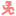
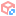
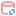

# <div class="icon" style="mask-image: url(./medias/godot-icons/Camera.svg)"></div> Atelier 4 - Walking Simulator

Dans cet atelier, on va créer un jeu en 3D type [walking simulator](#ressources-suplementaires/lexique-game-dev.md#walking-simulator).

<details class="learning-details">
    <summary>Concepts Abordés</summary>
    <ul>
        <li>La 3D dans Godot</li>
        <li>Les contrôles en <a href="#ressources-suplementaires/lexique-game-dev.md#fps">FPS</a></li>
        <li>Les assets 3D</li>
    </ul>
</details>

<!-- ## Jeu

Jeu en cours -->

## Création du projet

Comme d'habitude, on créé un nouveau projet, je vais l'appeller *"Walking Simulator"*. À ce projet on ajoute le fichier *"/assets/"* que vous pouvez télécharger <a href="https://downgit.github.io/#/home?url=https://github.com/RSelaries/ateliers-gamejam/tree/main/projets/walking_simulator/assets" class="external-link" target="_blank">ici</a>.

<div class="side-by-side">
<viewable-image src="./medias/walking-simulator/create-project-1.png"></viewable-image>
<viewable-image src="./medias/walking-simulator/create-project-2.png"></viewable-image>
</div>

> <span style="font-size: 0.8em; color: var(--body-text-color-faded)">Pour ce projet, si vous voulez avoir plus de paramètres et avoir accès a de meilleures lumières et ombres vous pouvez utiliser le renderer <strong>Forward+</strong>. Mais si votre PC n'est pas très puissant je vous conseille de rester en <strong>Compatibility</strong>.</span><br>
> <span style="font-size: 0.8em; color: var(--body-text-color-faded)">Étant donné que j'upload les jeux sur ce site web je dois utiliser le mode <strong>Compatibility</strong>.</span>

## L'interface 3D

Pour **tourner la camera 3D** il faut déplacer la couris en cliquant sur le **clique-molette**, pour **se déplacer** il faut utiliser les touches **ZQSD** en enfonçant la touche **clique-droit**.

La plupart des [ Node2D](#godot/nodes.md#node2d) ont un équivalent [ Node3D](#godot/nodes.md#node3d). Leurs variables et fonctions sont souvent les même mais avec simplement un axe en plus. <span style="font-size: 0.8em; color: var(--body-text-color-faded)">(l'axe <code>z</code>)</span>

<br>

<span style="font-size: 0.8em; color: var(--body-text-color-faded)">Ex: [ CharacterBody2D](#godot/nodes.md#characterbody2d) / [ CharacterBody3D](#godot/nodes.md#characterbody3d).</span>

> Pour plus d'information vous pouvez aller voir la page [interface 3D](#godot/interface.md#onglet-3d) ou lire <a href="https://docs.godotengine.org/en/stable/tutorials/3d/introduction_to_3d.html" class="documentation-link">la documentation</a>.

## Création de la scène de jeu

Pour commencer on va faire une scène très simple, qui va nous permettre de tester notre personnage plus tard. On créé alors une nouvelle scène avec un [ Node3D](#godot/nodes.md#node3d) en racine. On peut la renommer *"TestScene"*.

<viewable-image src="./medias/walking-simulator/test-scene-1.png"></viewable-image>

> **N'oubliez pas d'enregistrer !!!**

### Ajout du sol

Pour le **prototypage** de niveau 3D dans Godot on peut utiliser les nodes <a href="https://docs.godotengine.org/fr/4.x/tutorials/3d/csg_tools.html" class="documentation-link">CSG</a>. Ce sont des outils qui permettent de créer de la **géométrie simple** <span style="font-size: 0.8em; color: var(--body-text-color-faded)">(des cubes: [ CSGBox3D](#godot/nodes.md#CSGBox3D), des cylindres [ CSGCylinder3D](#godot/nodes.md#CSGCylinder3D), etc.)</span> et de leur appliquer des <a href="https://fr.wikipedia.org/wiki/Op%C3%A9rations_bool%C3%A9ennes_sur_les_polygones" class="wikipedia-link">oppérations booléennes</a>.

<br>

On peut donc créer un sol à l'aide d'un [ CSGBox3D](#godot/nodes.md#CSGBox3D).

<viewable-image src="./medias/walking-simulator/test-scene-2.gif"></viewable-image>

Pour modifier un [ CSGBox3D](#godot/nodes.md#CSGBox3D), on peut soit utiliser **les poignées sur une de ces 6 faces** <span style="font-size: 0.8em; color: var(--body-text-color-faded)">(les ronds rouges)</span>, soit modifier directement sa propriété `size`.

<viewable-image src="./medias/walking-simulator/test-scene-3.gif"></viewable-image>

Si on veut que notre sol ai une collision, on doit activé la propriété `use_collision` de notre [ CSGBox3D](#godot/nodes.md#CSGBox3D).

<viewable-image src="./medias/walking-simulator/test-scene-4.png"></viewable-image>

Enfin, si on veut mieux visualiser les distances, on peut ajouter un matériel à notre sol.

> En 3D, les **matériaux** définissent comment sera représenté un objet: sa *texture*, sa *rugosité*, son *aspect métalique*, *lisse* etc...
> <br><span style="font-size: 0.8em; color: var(--body-text-color-faded)">On appelle cette manière de représenter les matériaux ***"PBR"*** pour ***P****hysically* ***B****ased* ***R**endering*.</span>

Pour ça on peut modifier sa propriété `material` en utilisant un des matériaux de prototypage que je vous ai fourni:

<viewable-image src="./medias/walking-simulator/test-scene-5.gif"></viewable-image>

### Ajout d'un environnement

Si on test la scène actuelle on vera qu'on a un problème:

<viewable-image src="./medias/walking-simulator/test-scene-6.png"></viewable-image>

Contrairement à ce qu'on voit dans l'éditeur, **la scène n'as ni environnement, ni lumière**. En effet par défaut Godot fait une **prévisualisation** des scènes 3D avec un *soleil* et un *environnement* basique. On peut *désactiver* cette prévisualisation, mais on peut sortout **les ajouter à notre scène**:

<viewable-image src="./medias/walking-simulator/test-scene-7.gif"></viewable-image>

Ce qui donne:

<viewable-image src="./medias/walking-simulator/test-scene-8.png"></viewable-image>

## Création du personnage

Maintenant qu'on a une scène de jeu, on peut passer à la *création de notre personnage joueur*.

<br>

Comme pour le [jeu de plateforme](#ateliers/jeu-de-plateforme.md#creation-du-personnage), on va créer une scène de jeu avec un [ CharacterBody3D](#godot/nodes.md#characterbody3d) en racine, auquel on va ajouter une [ CollisionShape3D](#godot/nodes.md#collisionshape3d).

<viewable-image src="./medias/walking-simulator/player-1.gif"></viewable-image>

Et n'oubliez pas d'enregistrer la scène!

<viewable-image src="./medias/walking-simulator/player-2.png"></viewable-image>

Ensuite on ajoute une `shape` à la [ CollisionShape3D](#godot/nodes.md#collisionshape3d). La collision la plus souvent utilisée pour les personnages dans un jeu 3D est la forme de *"capsule"*:

<viewable-image src="./medias/walking-simulator/player-3.gif"></viewable-image>

### Camera3D

Pour une camera type [FPS](#ressources-suplementaires/lexique-game-dev.md#fps) on doit ajouter un **point de rotation** à la [ Camera3D](#godot/nodes.md#camera3d).

On peut renommer le [ Node3D](#godot/nodes.md#node3d) *"Neck"*, étant donné qu'il représente le cou du personnage. On va également le déplacer en `0, 0.75, 0` pour que la camera soit au niveau des yeux.

<viewable-image src="./medias/walking-simulator/player-4.gif"></viewable-image>

## Programmation

Enfin, on peut passer à la *programmation* du personnage. Pour ça on ajoute un **script** à notre scène, en n'oubliant pas de sélectionner le **template** *Basic Movement* du [ CharacterBody3D](#godot/nodes.md#characterbody3d).

<viewable-image src="./medias/walking-simulator/player-5.gif"></viewable-image>

Et on ajoute à notre script une référence aux nodes *"Neck"* et *"Camera3D"*.

<viewable-image src="./medias/walking-simulator/player-6.gif"></viewable-image>

> <span style="font-size: 0.8em; color: var(--body-text-color-faded)">**Rappel**: Pour ajouter des références de nodes à un script, utilisez la touche `Ctrl` en glissant les nodes.</span>

Si vous voulez un rappel de comment fonctionne le script de déplacement, n'hésitez pas à lire la [section du script du jeu de plateforme](#ateliers/jeu-de-plateforme.md#programmation-du-personnage).

```gdscript
extends CharacterBody3D


const SPEED = 5.0
const JUMP_VELOCITY = 4.5

@onready var neck: Node3D = %Neck
@onready var camera_3d: Camera3D = %Camera3D

func _physics_process(delta: float) -> void:
	# Add the gravity.
	if not is_on_floor():
		velocity += get_gravity() * delta

	# Handle jump.
	if Input.is_action_just_pressed("ui_accept") and is_on_floor():
		velocity.y = JUMP_VELOCITY

	# Get the input direction and handle the movement/deceleration.
	# As good practice, you should replace UI actions with custom gameplay actions.
	var input_dir := Input.get_vector("ui_left", "ui_right", "ui_up", "ui_down")
	var direction := (transform.basis * Vector3(input_dir.x, 0, input_dir.y)).normalized()
	if direction:
		velocity.x = direction.x * SPEED
		velocity.z = direction.z * SPEED
	else:
		velocity.x = move_toward(velocity.x, 0, SPEED)
		velocity.z = move_toward(velocity.z, 0, SPEED)

	move_and_slide()
```

La seule différence avec le script 2D est dans les lignes:

```gdscript
var input_dir := Input.get_vector("ui_left", "ui_right", "ui_up", "ui_down")
var direction := (transform.basis * Vector3(input_dir.x, 0, input_dir.y)).normalized()
```

Ici, `input_dir` n'est pas un `float` comme en 2D, mais un `Vector2`: en 2D le personnage **avance** ou **recule**, mais ne peut pas *"avancer"* vers le haut on le bas, il ne peut que sauter ou tomber. En 3D, le personnage peut **avancer** et **reculer**, mais aussi aller **à droite** et **à gauche** en plus de sauter et tomber.

<br>

Enfin on calcule la `direction` à partir de `input_dir` mais dans un `Vector3` <span style="font-size: 0.8em; color: var(--body-text-color-faded)">(donc en 3D)</span> et on la normalise *(pour que le déplacement en diagonale ne soit pas plus rapide qu'en avant ou arrière)*.

On voit aussi qu'on a multiplié la direction par `transform.basis`. Cela nous permet de s'assurer que *"devant"* est relatif au joueur.

### Rotation de la caméra

Ajoutons maintenant la logique de la caméra. Pour ça on ajoute la fonction suivante dans le script de notre personnage:

```gdscript
func _unhandled_input(event: InputEvent) -> void:
	if event is InputEventMouseMotion:
		neck.rotate_y(-event.relative.x * 0.003)
		camera_3d.rotate_x(-event.relative.y * 0.003)
```

**Pour rappel**: la fonction `_unhandled_input` est appellée à chaque entrée du clavier, de la souris ou d'une manette.

Dans cette fonction, on *test* d'abord si l'évenement qu'on reçoit est un *déplacement de la souris*. Et *si c'est le cas*, on applique une rotation à la caméra et à la nuque du personnage. <span style="font-size: 0.8em; color: var(--body-text-color-faded)">(Vous remarquerez peut être que la valeur a été multipliée par 0.003. Ce chiffre représente la sensibilité de la souris. Vous pouvez essayer de le changer pour voir ce que cela change).</span>

## Test du jeu

On peut ajouter le personnage à notre scène de jeu et le tester:

<viewable-image src="./medias/walking-simulator/test-game-1.gif"></viewable-image>

En testant le jeu, on se rend compte que **le déplacement ne suit pas la cameré**. Également, **la souris est visible** et ne devrait pas l'être.

### Déplacements vis-à-vis de la caméra

Pour régler le premier soucis rien de plus simple. Au lieu d'utiliser `transform.basis` du personnage entier, on doit se fier à la direction vers laquelle regarde le joueur. Pour cela on modifie `transform.basis` en `neck.global_transform.basis`:

```gdscript
var direction := (neck.global_transform.basis * Vector3(input_dir.x, 0, input_dir.y)).normalized()
```

Maintenant le déplacement suit la rotation du la caméra:

<viewable-image src="./medias/walking-simulator/test-game-2.gif"></viewable-image>

### Curseur de souris

Enfin on aimerai que le jeu cache la souris. Pour ça on va modifier le code de la fonction `_unhandled_input`:

```gdscript
func _unhandled_input(event: InputEvent) -> void:
	if event is InputEventMouseMotion and Input.mouse_mode == Input.MOUSE_MODE_CAPTURED:
		neck.rotate_y(-event.relative.x * 0.003)
		camera_3d.rotate_x(-event.relative.y * 0.003)
	
	if event is InputEventMouseButton:
		if event.button_index == MOUSE_BUTTON_LEFT and event.is_pressed():
			Input.mouse_mode = Input.MOUSE_MODE_CAPTURED
	if event is InputEventKey:
		if event.keycode == KEY_ESCAPE and event.is_pressed():
			Input.mouse_mode = Input.MOUSE_MODE_VISIBLE
```

Pour s'assurer que **la caméra ne se tourne que quand la souris est dans le jeu** on *test* si la souris est en mode `MOUSE_MODE_CAPTURED`. Ensuite on a ajouté le fait de **capturer le curseur** si on detectait un **clique-gauche**, et de **libérer** la souris si on détecte la touche ***"Échap"***.

<viewable-image src="./medias/walking-simulator/test-game-3.gif"></viewable-image>

## Création du niveau

Le jeu est maintenant fini, on a un personnage jouable qui peut se déplacer dans on environnement. Il ne reste plus qu'à créer un niveau.