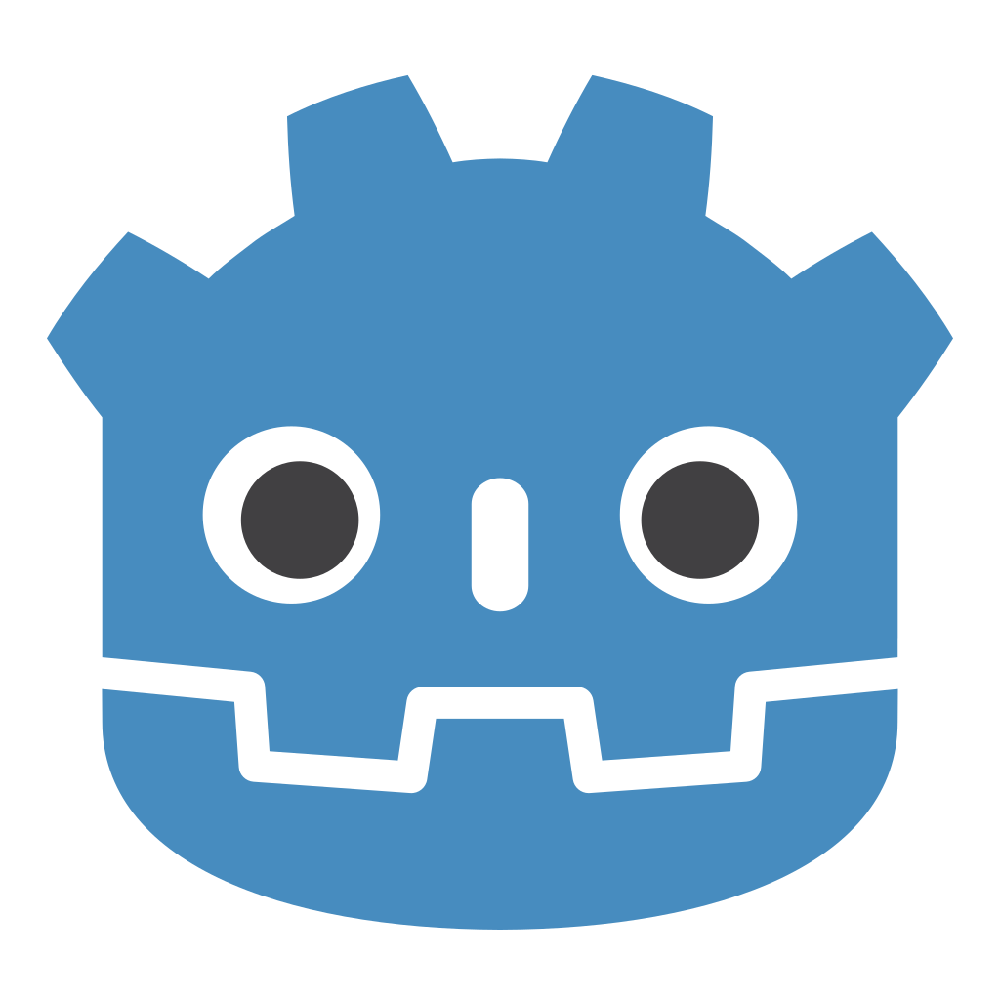

# 

 L'interface utilisateur

L'interface utilisateur ou **UI** (User Interface. Parfois GUI: Graphical User Inteface) représente tous les éléments avec lequel l'utilisateur **intéragit**.

 

Dans  **Godot**, pour créer toute sorte d'**UI**, on va utiliser les nodes [ Control](#godot/nodes.md#control). Les nodes [ Control](#godot/nodes.md#control) sont des **boutons**, **textes**, **images** mais surtout des **conteneurs** qui permettent de mettre en page des éléments.

<viewable-image src="./medias/control-nodes/control-nodes-1.png"></viewable-image>

<h1 style="justify-content: center">

Page en cours

</h1>