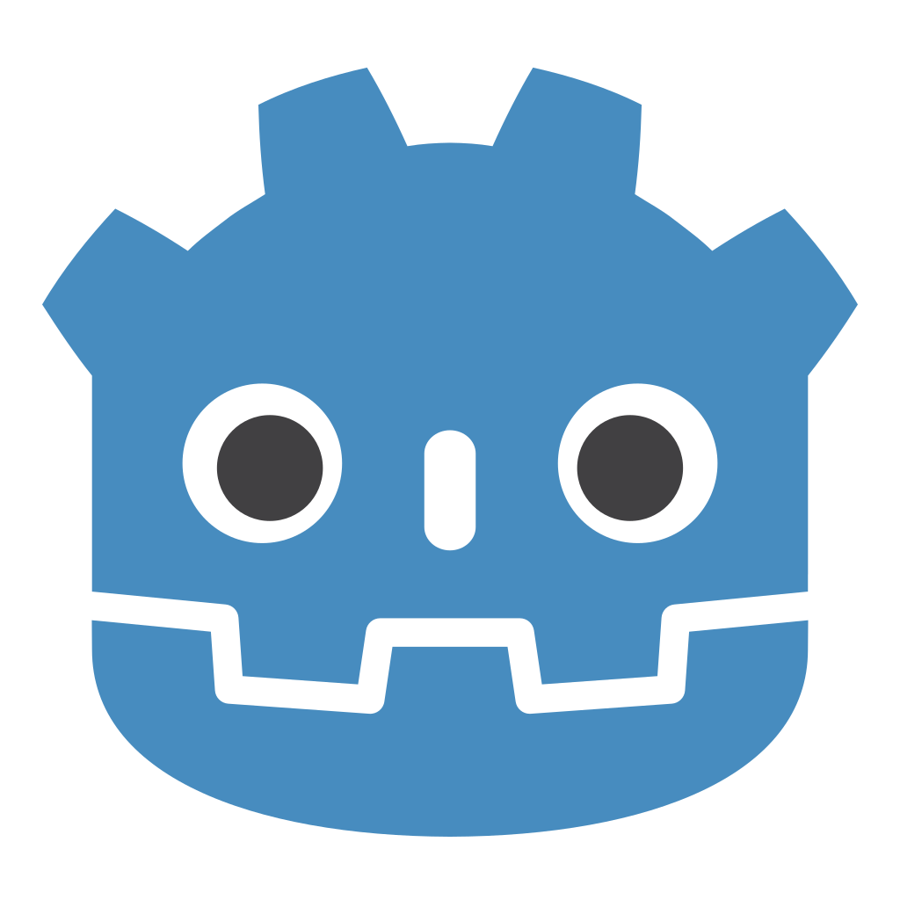
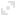
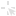
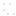
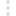
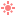
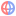
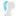
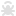

# L'Interface de Godot

## Project Manager

C'est la **première fenêtre** qui s'ouvre quand on ouvre l'exécutable [ Godot](#godot/godot.md).

C'est ici que l'on va retrouver **tous nos projets**. À partir de cette fenêtre **on peut**: **créer** un nouveau projet, **éditer** un projet, **lancer** une preview du projet.

En haut, on retrouve les boutons:

- ** Create**: Ce bouton ouvre la fenêtre de création de projet

- ** Import**: Ce bouton permet d'**importer** un projet.

- ** Scan**: Ce bouton permet de **scanner un dossier entier** pour importer **plusieurs projets d'un coup**.

Ensuite on a une liste de tous nos projets.

## Onglets principaux

La fenêtre principale de [ Godot](#godot/godot.md) se compose par défaut de 5 onglets: [ 2D](#godot/interface.md#onglet-2d), [ 3D](#godot/interface.md#onglet-3d), [ Script](#godot/interface.md#onglet-script), [ Game](#godot/interface.md#onglet-game), [ AssetLib](#godot/interface.md#onglet-assetlib).

Certains [plugins](#godot/godot.md#plugins) peuvent ajouter de **nouveaux onglets**.

On retrouve à chaque fois les [ scènes](#godot/godot.md#scenes) que l'on a ouvert.

### Onglet  2D

Permet d'**éditer** tous les **élements 2D** (les [ Node2D](#godot/nodes.md#node2d) et [ Control](#godot/nodes.md#control)).

#### Outils 2D

Dans l'ordre:

-  Sélection

-  Déplacement

-  Rotation

-  Échelle

-  Sélection Liste (Permet de sélectionner un objet précis quand plusieurs objets se superposent)

-  Point de Pivot

-  Panorama (Permet de déplacer la vue)

-  Règle (Permet de mesurer des distances)

-  Espace Local (Permet de modifier l'obect dans son espace local et non plus dans l'espace global)

-  Magnétisme

-  Magnétisme de Grille

-  Options de Magnétisme et de Grille

-  Vérouiller les Nodes

-  Grouper les Nodes (Si un des nodes enfant est selectioné, le parent sera selectionné)

-  Options de Squellette

- Options d'affichage

### Onglet  3D

Permet d'**éditer** tous les **élements 3D** (les [ Node3D](#godot/nodes.md#node3d)).

#### Outils 3D

Dans l'ordre:

-  Transformation

-  Déplacement

-  Rotation

-  Échelle

-  Sélection

-  Sélection Liste (Permet de sélectionner un objet précis quand plusieurs objets se superposent)

-  Vérouiller les Nodes

-  Grouper les Nodes (Si un des nodes enfant est selectioné, le parent sera selectionné)

-  Règle (Permet de mesurer des distances)

-  Espace Local (Permet de modifier l'obect dans son espace local et non plus dans l'espace global)

-  Magnétisme

-  Prévisualisation Soleil (Voir [ DirectionalLight3D](#godot/nodes.md#directionallight3d))

-  Prévisualisation Environement (Voir [ WorldEnvironment](#godot/nodes.md#worldenvironment))

-  Options de Soleil et Environement

- Options de transformation

- Options d'affichage

### Onglet  Script

Permet d'**éditer** les scripts de nos [ Nodes](#godot/nodes.md#node).

On y retrouve en **haut à gauche** la liste des **scripts ouverts**. En **bas à gauche** la **liste des fonctions** du script actuel. Enfin la **fenêtre de droite** où on retrouve le **script en lui-même**.

### Onglet  Game

Cette fenêtre permet d'**intéragir avec le jeu** quand on le lance.

    
    

Quand le jeu est lancé on peut voir que l'[Output](#godot/interface.md#output) s'ouvre automatiquement.

#### Outils Game

Dans l'ordre:

-  Play / Pause

-  Prochaine [Frame](#ressources-suplementaires/lexique-game-dev.md#frame) (Permet d'avancer d'une frame quand le jeu est en pause)

- 1.0x Vitesse du jeu

-  Réinitialiser la vitesse du jeu (Remet la vitesse du jeu à 1.0x)

-  Intéragir avec le jeu (Les appuies de touches et les clics de souris seronts captés par le jeu)

-  Sélection 2D (Permet de sélectionner les [ Node2D](#godot/nodes.md#node2d) et [ Control](#godot/nodes.md#control))

-  Sélection 3D (Permet de sélectionner les [ Node3D](#godot/nodes.md#node3d))

-  Sélection

-  Sélection Liste (Permet de sélectionner un objet précis quand plusieurs objets se superposent)

-  Affichage de la sélection (Permet d'afficher ou non le rectangle jaune autour de l'objet sélectionné)

-  Paramètres de sélection

-  Couper le son

-  Camera Libre

-  Paramètres de camera

-  Paramètres d'Affichage

### Onglet  AssetLib

L'onglet **AssetLib** permet d'accéder aux **créations** et [plugins](#godot/godot.md#plugins) de la **communauté**.

## SceneTree

Le SceneTree permet de **visualiser** et **modifer** l'**arborescence de la scène** actuellement ouverte.

Les [ nodes](#godot/nodes.md#node) en **bas** de la liste sont au **premier plan**. Les **enfants** d'un [ node](#godot/nodes.md#node) sont représentés **en dessous** et **décalés à droite**.

## FileSystem

Le FileSystem permet d'**accéder à tous les fichiers de notre projet**. Il se situe par défaut en bas à gauche en forme de liste, mais il est possible de **changer son emplacement et son affichage**.

    
    

## Inspecteur

L'inspecteur permet de **modifier** les **propriétés** d'un [ Node](#godot/nodes.md#node) ou d'une [ Ressource](#godot/godot.md#ressources).

    
    

## Onglets en bas

Par défaut, le menu du bas contient 5 onglets: [ Output](#godot/interface.md#output), [ Debugger](#godot/interface.md#debugger), [ Audio](#godot/interface.md#audio), [ Animation](#godot/interface.md#animation), [ Shader Editor](#godot/interface.md#shader-editor). En modifiant **certains [ Node](#godot/nodes.md#node)** ou **[ Ressource](#godot/godot.md#ressources)**, ou bien avec certains **plugins**, de **nouveaux onglets** peuvent s'ajouter.

###  Output

L'output affiche toutes les **erreurs**, les **avertissements**, et les text qui ont été `print`.

###  Debugger

Le Debugger est une interface riche et complexe qui vas afficher les erreurs et leur *stack trace* (C'est à dire la fonction dans laquelle l'erreur à eu lieu, et la ligne qui a appelé cette fonction et la fonction qui l'a appelé...)

Le Debugger est très utile pour l'**optimisation**, mais ce n'est pas quelque chose qui nous intéresse pour l'instant. (Et je ne sais moi-même pas trop utiliser le debugger...)

###  Audio 

###  Animation

###  Shader Editor

###  Theme

## Autres fenêtres

### Historique

### Import

### History

### Signaux

### Groupes

