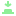

# Les Nodes de Godot

Cette page contient une explication courte et simple des Nodes que nous allons utiliser. Pour plus d'informations vous pouvez aller directement sur la <a href="https://docs.godotengine.org/en/stable/classes/index.html#nodes" class="external-link">documentation officielle de Godot</a>.

<!-- Node -->

##  Node

Le  Node le plus simple, il fonctionne dans le  [SceneTree](#godot/godot.md#scenetree). Et implémente les fonctions `_ready` et `_process`.

> <a href="https://docs.godotengine.org/en/stable/classes/class_node.html" class="external-link">Documentation officielle</a>

<!-- Node2D -->

##  Node2D

La famille des  Node2D représente tous les [ Nodes](#godot/nodes.md#node) utilisés pour tous les éléments de jeu en 2D (sauf les éléments d'[interfaces utilisateur](#godot/control.md)).

> <a href="https://docs.godotengine.org/en/stable/classes/class_characterbody2d.html" class="external-link">Documentation officielle</a>

###  CharacterBody2D

Un  CharacterBody2D est un [ Node2D](#godot/nodes.md#node) utilisé pour créer des **personnages** qui subissent la **physique**. (Gravité, collisions avec les murs...)

> <a href="https://docs.godotengine.org/en/stable/classes/class_characterbody2d.html" class="external-link">Documentation officielle</a>

###  TileMapLayer

Un  TileMapLayer est un [ Node2D](#godot/nodes.md#node) qui permet d'arranger des tuiles d'un <a class="external-link" href="https://docs.godotengine.org/en/stable/classes/class_tileset.html#tileset"> TileSet</a>

> <a href="https://docs.godotengine.org/en/stable/classes/class_tilemaplayer.html" class="external-link">Documentation officielle</a>

<!-- Control -->

##  Control

La famille des  Control représente tous les [ Nodes](#godot/nodes.md#node) utilisés pour les [interfaces utilisateur](#godot/control.md).

> <a href="https://docs.godotengine.org/en/stable/classes/class_control.html" class="external-link">Documentation officielle</a>

###  Label

Un  Label est un [ Node](#godot/nodes.md#node) permettant d'**afficher du texte**. On peut modifier la taille de la police, la fonte, la couleur, le contour et plus.

> <a href="https://docs.godotengine.org/en/stable/classes/class_label.html" class="external-link">Documentation officielle</a>

###  Button

Un  Button est un [ Node](#godot/nodes.md#node) qui permet de créer un bouton clickable.

> <a href="https://docs.godotengine.org/en/stable/classes/class_button.html" class="external-link">Documentation officielle</a>

###  LineEdit

Un  LineEdit est un [ Node](#godot/nodes.md#node) qui permet à l'utilisateur de rentrer du texte qui peut être récupéré par code.

> <a href="https://docs.godotengine.org/en/stable/classes/class_lineedit.html" class="external-link">Documentation officielle</a>

###  SpinBox

Un  SpinBox est un [ Node](#godot/nodes.md#node) qui permet çà l'utilisateur de rentrer un nombre qui peut être récupéré par code.

> <a href="https://docs.godotengine.org/en/stable/classes/class_spinbox.html" class="external-link">Documentation officielle</a>
