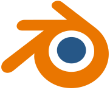

# Ateliers création de jeux-vidéo

Ce site est la documentation des ateliers de **création de jeux-vidéo** organisés par *<a class="external-link" href="https://sirius-productions.fr">Sirius Productions</a>* et *<a class="external-link" href="https://www.lasierraprod.com">La Sierra Prod</a>*.
Ces ateliers ont pour but de vous apprendre les bases du développement de jeux-vidéo pour ensuite organiser une gamejam.

> Les textes en jaune sont des liens internes *(ils redirigent vers d'autres pages de cette documentation)* et les textes bleu soulignés sont des liens externes *(ils redirigent vers des sites externes)*.

> Si vous trouvez quelconque **faute**, **erreure**, **manquement**... n'hésitez pas à ouvrir une *<a class="external-link" href="https://github.com/RSelaries/ateliers-gamejam/issues/new">issue sur le Github</a>* ou bien à m'envoyer un <a class="external-link" href="https://discordapp.com/users/cri.staline">mp discord</a> !

## Qu'est-ce qu'une gamejam ?

Une **gamejam** est un événement de création de jeux-vidéo ou de jeux de société en un temps limité *(24h, 48h, une semaine...)*. 
Les gamejams permettent de développer des idées de jeu novatrices, certains jeux indépendants ont d'ailleurs commencé en tant que projets de gamejam *(Celeste, SuperHot, Baba is You, Inscryption...)*.

Les gamejams sont des évènements très ouverts, de nombreuses personnes participent à leur première gamejam sans avoir jamais créé de jeu. **Tout le monde est le bienvenu** et peut participer à son échelle: *musique*, *dessins*, *idées de jeu*... il y a toujours quelque chose à apporter.

## Comment s'organisent ces ateliers ?

/!\ Organisation à prévoir /!\\

<!--

Il y aura **deux ateliers par mois**. Le premier est un atelier **théorique**, et le deuxième un atelier **pratique**.

### Ateliers théoriques

Les ateliers théoriques sont l'occasion d'aborder le **game-design**, l'**écriture de scénario**, le design **UI**/**UX** et plus. 
Ils prennent place dans les locaux de *<a class="external-link" href="[https://www.lasierraprod.com">La Sierra Prod</a>* et sont organisés par leurs animateurs.

### Ateliers pratiques

Les ateliers pratiques s'organisent par **projet**. Chaque atelier sera **un nouveau jeu** que l'on va développer pour **apprendre** petit à petit la programmation et le développement de jeux-vidéo.
Ils prennent place aux seins des locaux de *<a class="external-link" href="https://sirius-productions.fr">Sirius Productions</a>* et sont organisés par moi-même *(Raphaël, service civique à Sirius)*.

 -->

## Quels outils on va utiliser ?

Voici la liste des outils que l'on va utiliser pendant ces ateliers. 
*(Je fais ici une liste de **tous** les outils utiles pour le gamedev, nous n'aurons peut-être pas le temps de tous les utiliser mais vous pouvez aller les voir si vous êtes intéressés)*

###   [Godot](#godot/godot.md)

Godot est un **moteur de jeu** gratuit et **open source**. C'est le logiciel que l'on va le plus utiliser.

###  [Blender](#ressources-suplementaires/blender.md)

Blender est un logiciel de **modélisation 3D** gratuit et **open source**. On va l'utiliser pour créer les objets et personages (les [meshs](#ressources-suplementaires/lexique-game-dev.md#mesh)) de nos jeux en 3D.

###  [Blockbench](#ressources-suplementaires/blockbench.md)

Blockbench est un logiciel gratuit et **open-source** de **modélisation 3D** simplifié. Il sert initialement à modéliser des personnages et blocks pour Minecraft et Hytale mais peut aussi être utilisé pour faire des modèles en [low-poly](#ressources-suplementaires/lexique-game-dev.md#low-poly) et [pixel art](#ressources-suplementaires/lexique-game-dev.md#pixel-art).

###  [Pixelorama](#ressources-suplementaires/pixelorama.md)

Pixelorama est un logiciel de [pixel art](#ressources-suplementaires/lexique-game-dev.md#pixel-art) gratuit et **open source**. On pourra l'utiliser pour créer les [sprites](#ressources-suplementaires/lexique-game-dev.md#sprite) pour nos jeux 2D.
> Pixelorama a été développé avec le moteur [Godot](#ressources-suplementaires/godot.md) !