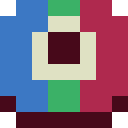

#  Pixelorama

<a href="https://pixelorama.org/" class="external-link">Pixelorama</a> est un logiciel de dessin en [pixel art](#ressources-suplementaires/lexique-game-dev.md#pixel-art) **gratuit** et **open-source**.

 

Aujourd'hui le logiciel de dessin [pixel art](#ressources-suplementaires/lexique-game-dev.md#pixel-art) le plus populaire est <a href="https://www.aseprite.org/" class="external-link">Aseprite</a>, il est **open-source** mais **pas totalement gratuit**. Plus précisément, il est **possible** pour n'importe qui de **compiler** le logiciel et de l'**utiliser gratuitement**, mais ce n'est **pas** un processus **simple** pour quelqu'un qui ne l'a jamais fait. Aseprite propose un version compilée et simple d'utilisation pour un bas prix.

> Pixelorama a été développé avec le moteur [Godot](#ressources-suplementaires/godot.md) !

> Il existe aussi le logiciel <a href="https://www.materialmaker.org/" class="external-link">Material Maker</a> qui permet de créer des textures et shaders pour le game-dev qui est développé avec [Godot](#ressources-suplementaires/godot.md). *(Il est lui aussi **gratuit** et **open-spource**)*

